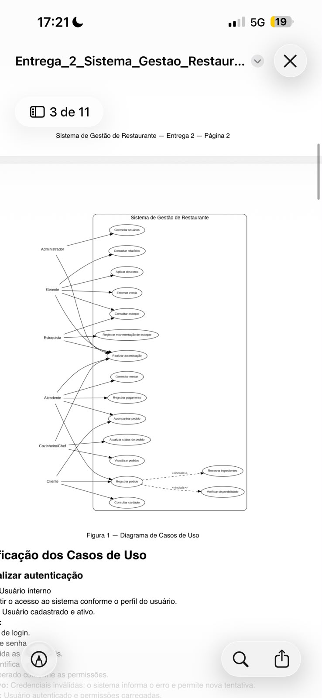

# 2. Construção do Diagrama de Casos de Uso

O diagrama de casos de uso representa as principais funcionalidades do **Sistema de Gestão de Restaurante** e a forma como os diferentes atores interagem com essas funcionalidades.

Os casos de uso foram nomeados utilizando verbos no infinitivo, buscando representar de forma objetiva as ações disponíveis no sistema.

---

## 2.1 Atores do Sistema

Os principais atores identificados são:

- **Administrador**
- **Gerente**
- **Estoquista**
- **Atendente**
- **Cozinheiro/Chef**
- **Cliente**

Cada ator possui acesso somente às funcionalidades relacionadas às suas responsabilidades dentro do restaurante.

---

## 2.2 Principais Casos de Uso

O sistema possui os seguintes casos de uso principais:

- Gerenciar usuários.
- Consultar relatórios.
- Aplicar desconto.
- Estornar venda.
- Consultar estoque.
- Registrar movimentação de estoque.
- Realizar autenticação.
- Gerenciar mesas.
- Registrar pagamento.
- Acompanhar pedido.
- Atualizar status do pedido.
- Visualizar pedidos.
- Registrar pedido.
- Consultar cardápio.
- Reservar ingredientes.
- Verificar disponibilidade dos ingredientes.

---

## 2.3 Relação entre Atores e Casos de Uso

### Administrador

O Administrador possui acesso às funcionalidades administrativas e de gerenciamento do sistema, incluindo:

- Gerenciar usuários.
- Realizar autenticação.

---

### Gerente

O Gerente possui acesso às funções relacionadas à supervisão e ao gerenciamento do estabelecimento, incluindo:

- Consultar relatórios.
- Aplicar desconto.
- Estornar venda.
- Consultar estoque.
- Realizar autenticação.

---

### Estoquista

O Estoquista é responsável principalmente pelo controle do estoque e possui acesso às seguintes funcionalidades:

- Consultar estoque.
- Registrar movimentação de estoque.
- Realizar autenticação.

---

### Atendente

O Atendente é responsável pelo atendimento aos clientes e pelas operações relacionadas às mesas, pedidos e pagamentos.

Suas principais funcionalidades são:

- Realizar autenticação.
- Gerenciar mesas.
- Registrar pagamento.
- Acompanhar pedido.
- Registrar pedido.

---

### Cozinheiro/Chef

O Cozinheiro/Chef utiliza principalmente as funcionalidades relacionadas ao acompanhamento e preparo dos pedidos.

Suas principais funcionalidades são:

- Realizar autenticação.
- Acompanhar pedido.
- Atualizar status do pedido.
- Visualizar pedidos.

---

### Cliente

O Cliente possui acesso limitado às funcionalidades destinadas ao atendimento presencial.

Suas principais funcionalidades são:

- Registrar pedido.
- Consultar cardápio.

Na primeira versão do sistema, o cliente não possui uma conta pessoal. Seu acesso é realizado por meio da identificação da mesa.

---

## 2.4 Relações de Inclusão

O caso de uso **Registrar pedido** depende de outras operações necessárias para que o pedido possa ser confirmado.

Dessa forma, o processo inclui:

- **Verificar disponibilidade dos ingredientes**.
- **Reservar ingredientes**.

Essas operações garantem que o sistema somente confirme pedidos quando houver ingredientes suficientes e que os ingredientes necessários sejam reservados após a confirmação.

---

## 2.5 Diagrama de Casos de Uso

O diagrama abaixo apresenta visualmente os atores, os casos de uso e suas relações dentro do Sistema de Gestão de Restaurante.

> **Observação:** O arquivo da imagem do diagrama deve ser armazenado na pasta `imagens` dentro da pasta `2°Entrega`.

---

## 2.6 Relação com os Requisitos Funcionais

O diagrama foi elaborado com base nos requisitos funcionais definidos na primeira entrega.

Entre as principais relações estão:

| Caso de uso | Requisitos relacionados |
|---|---|
| Gerenciar usuários | RF01, RF03 |
| Realizar autenticação | RF02, RF03 |
| Consultar estoque | RF06, RF15, RF16 |
| Registrar movimentação de estoque | RF15, RF16 |
| Gerenciar mesas | RF08 |
| Registrar pedido | RF08, RF09, RF12, RF13 |
| Acompanhar pedido | RF10 |
| Visualizar pedidos | RF10, RF11 |
| Atualizar status do pedido | RF10, RF11, RF14, RF21 |
| Registrar pagamento | RF17, RF18 |
| Aplicar desconto | RF19 |
| Estornar venda | RF19 |
| Consultar relatórios | RF20 |
| Consultar cardápio | RF05, RF09 |
| Verificar disponibilidade dos ingredientes | RF12 |
| Reservar ingredientes | RF13 |

---

## Resultado

O diagrama de casos de uso permite visualizar de forma geral como os diferentes perfis interagem com o sistema e quais funcionalidades estão disponíveis para cada um.

Essa modelagem serve como base para a especificação detalhada dos casos de uso e para os demais modelos desenvolvidos na segunda entrega.
