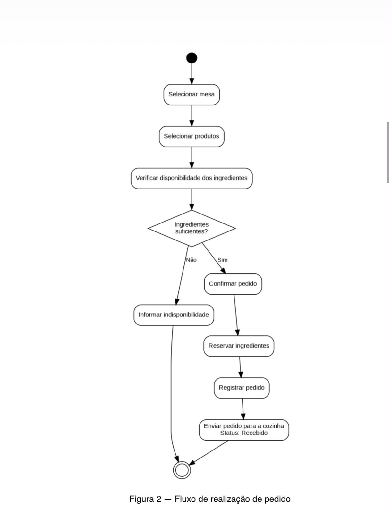
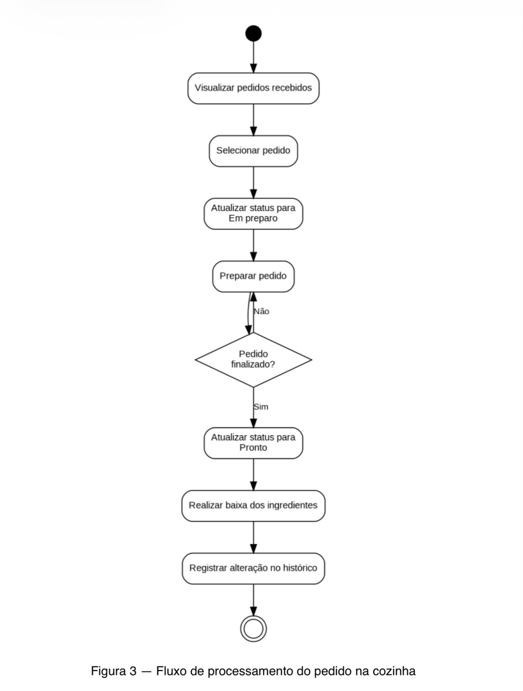
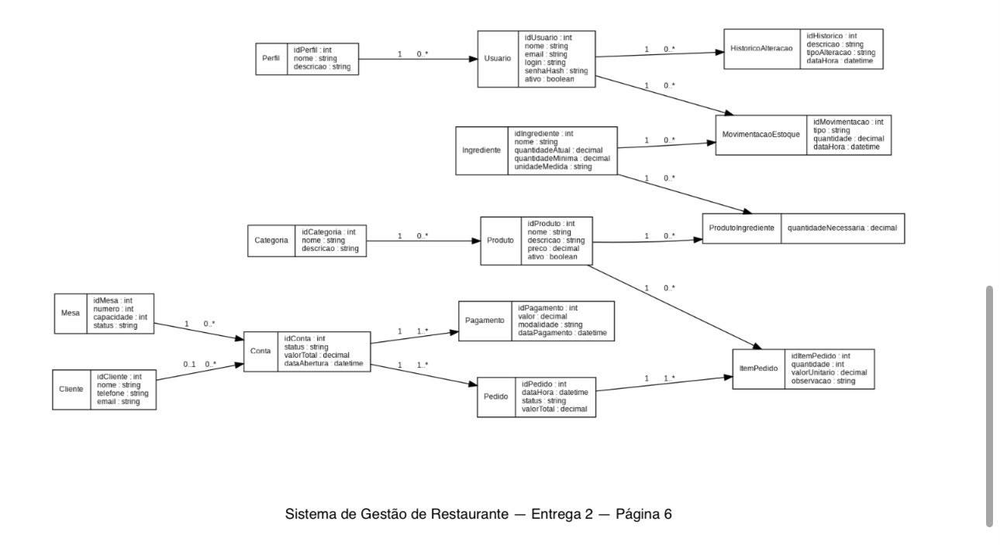

# 4. Diagramas de Atividades

Nesta etapa foram desenvolvidos dois diagramas de atividades para representar o fluxo das principais operações relacionadas aos pedidos do **Sistema de Gestão de Restaurante**.

Os processos modelados foram:

1. **Realizar pedido**
2. **Processar pedido na cozinha**

Os diagramas apresentam a sequência das atividades, decisões e alterações realizadas pelo sistema durante esses processos.

---

## 4.1 Realizar Pedido

O primeiro diagrama representa o processo de realização de um pedido, desde a identificação da mesa e seleção dos produtos até o registro e disponibilização do pedido para a cozinha.

Antes da confirmação, o sistema verifica se existem ingredientes suficientes para a preparação dos produtos selecionados.

Caso os ingredientes não estejam disponíveis, o sistema informa a indisponibilidade e o pedido não é confirmado.

Caso existam ingredientes suficientes, o pedido é confirmado, registrado com status **Recebido**, os ingredientes necessários são reservados e o pedido fica disponível para a cozinha.

### Diagrama de Atividades



[🔎 Abrir diagrama de Realizar Pedido em tamanho original](./imagens/diagrama-atividade-realizar-pedido.jpeg)

### Fluxo representado

1. Identificar ou selecionar a mesa.
2. Selecionar os produtos.
3. Verificar a disponibilidade dos ingredientes.
4. Verificar se existem ingredientes suficientes.
5. Caso não existam, informar a indisponibilidade.
6. Caso existam, confirmar o pedido.
7. Registrar o pedido com status **Recebido**.
8. Reservar os ingredientes necessários.
9. Disponibilizar o pedido para a cozinha.
10. Encerrar o processo.

### Requisitos relacionados

- **RF08** — Registro e gerenciamento de pedidos vinculados a uma mesa.
- **RF09** — Realização de pedidos pelo cliente utilizando a identificação da mesa.
- **RF12** — Verificação da disponibilidade dos ingredientes antes da confirmação do pedido.
- **RF13** — Reserva dos ingredientes necessários após a confirmação do pedido.

### Regras de negócio relacionadas

- **RN08** — O estoque físico não pode ficar abaixo de zero.
- **RN09** — Antes da confirmação do pedido, devem existir ingredientes suficientes.
- **RN10** — Os ingredientes necessários devem ser reservados quando o pedido for confirmado.
- **RN13** — Produtos que utilizam ingredientes controlados pelo estoque devem possuir sua composição cadastrada.

---

## 4.2 Processar Pedido na Cozinha

O segundo diagrama representa o fluxo de processamento de um pedido pela equipe da cozinha.

O processo começa quando o Cozinheiro/Chef visualiza os pedidos recebidos e seleciona aquele que será preparado.

Ao iniciar o preparo, o status do pedido é alterado para **Em preparo**. Quando a preparação é concluída, o pedido passa para o status **Pronto**.

Nesse momento, o sistema realiza a baixa dos ingredientes utilizados no estoque e registra a alteração no histórico.

### Diagrama de Atividades



[🔎 Abrir diagrama de Processar Pedido na Cozinha em tamanho original](./imagens/diagrama-atividade-processar-pedido.jpeg)

### Fluxo representado

1. Visualizar os pedidos recebidos.
2. Selecionar um pedido.
3. Atualizar o status do pedido para **Em preparo**.
4. Preparar o pedido.
5. Atualizar o status para **Pronto**.
6. Realizar a baixa dos ingredientes utilizados.
7. Registrar a alteração no histórico.
8. Encerrar o processo.

### Requisitos relacionados

- **RF10** — Acompanhamento e atualização dos status dos pedidos.
- **RF11** — Interface para a equipe da cozinha visualizar e atualizar os pedidos.
- **RF14** — Baixa dos ingredientes quando o pedido atingir o status Pronto.
- **RF21** — Registro do histórico de alterações relevantes.

### Regras de negócio relacionadas

- **RN04** — Pedidos enviados para a cozinha possuem restrições para cancelamento.
- **RN11** — Quando o pedido atingir o status Pronto, os ingredientes utilizados devem ser baixados do estoque físico.

---

## 4.3 Diagrama de Classes

Além dos diagramas de atividades, foi elaborado um **diagrama de classes** para representar a estrutura do domínio do Sistema de Gestão de Restaurante.

O diagrama apresenta as principais classes do sistema, seus atributos e os relacionamentos existentes entre elas, auxiliando na representação estrutural da solução e servindo como apoio para a construção dos modelos de dados.



[🔎 Abrir Diagrama de Classes em tamanho original](./imagens/diagrama-de-classes.jpeg)

O diagrama contempla as principais classes relacionadas ao funcionamento do sistema, incluindo usuários, clientes, produtos, ingredientes, mesas, contas, pedidos, pagamentos, estoque e histórico de alterações.

---
## 4.4 Relação entre os Diagramas

Os dois diagramas representam etapas consecutivas do processo de atendimento.

O diagrama **Realizar Pedido** representa a criação e confirmação do pedido, terminando quando ele é registrado com status **Recebido** e disponibilizado para a cozinha.

O diagrama **Processar Pedido na Cozinha** continua esse processo a partir do recebimento do pedido pela equipe da cozinha.

O fluxo principal dos status pode ser representado da seguinte forma:

```text
Pedido registrado
      │
      ▼
   Recebido
      │
      ▼
  Em preparo
      │
      ▼
    Pronto
```

Dessa forma, os dois diagramas mantêm continuidade entre o atendimento e o processo de preparação dos pedidos.

---

## Resultado

Os diagramas de atividades permitem visualizar de forma sequencial o comportamento das principais operações relacionadas aos pedidos.

O primeiro demonstra a seleção dos produtos, a verificação do estoque, a confirmação do pedido e a reserva dos ingredientes. O segundo representa o processamento realizado pela cozinha, incluindo a atualização dos status, a baixa dos ingredientes e o registro das alterações no histórico.

Os fluxos foram elaborados de forma consistente com os requisitos funcionais, regras de negócio e casos de uso definidos anteriormente.
