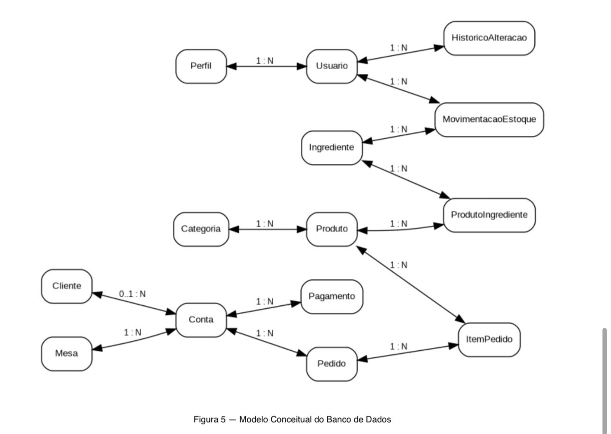

# 5. Construção do Modelo Conceitual do Banco de Dados

Nesta etapa foi desenvolvido o **modelo conceitual do banco de dados** do Sistema de Gestão de Restaurante.

O modelo conceitual representa as principais entidades do sistema e os relacionamentos existentes entre elas, sem detalhar ainda a implementação física das tabelas ou os tipos específicos de dados.

A modelagem foi construída com base nos requisitos funcionais, regras de negócio, casos de uso e processos definidos nas etapas anteriores.

---

## 5.1 Entidades Identificadas

Foram identificadas as seguintes entidades principais:

- **Perfil**
- **Usuario**
- **Cliente**
- **Categoria**
- **Produto**
- **Ingrediente**
- **ProdutoIngrediente**
- **Mesa**
- **Conta**
- **Pedido**
- **ItemPedido**
- **Pagamento**
- **MovimentacaoEstoque**
- **HistoricoAlteracao**
- **ReservaIngrediente**

---

## 5.2 Modelo Conceitual

O modelo abaixo apresenta as entidades e seus principais relacionamentos dentro do sistema.



[🔎 Abrir Modelo Conceitual em tamanho original](./imagens/modelo-conceitual-banco-de-dados.jpeg)

---

## 5.3 Descrição das Entidades

### Perfil

Representa os perfis de acesso utilizados pelos usuários internos do sistema.

Exemplos:

- Administrador
- Gerente
- Atendente
- Cozinheiro/Chef
- Estoquista

Um perfil pode estar associado a vários usuários, enquanto cada usuário possui apenas um perfil ativo.

---

### Usuario

Representa os usuários internos que utilizam o sistema.

O usuário possui um perfil que define quais funcionalidades podem ser acessadas.

Também pode estar relacionado às movimentações de estoque e aos registros de alterações realizadas no sistema.

---

### Cliente

Representa os clientes que podem ser identificados durante o atendimento.

O cadastro do cliente é opcional no atendimento presencial, pois o sistema também permite a utilização apenas por meio da identificação da mesa.

Um cliente pode estar associado a várias contas ao longo do tempo.

---

### Categoria

Representa as categorias utilizadas para organizar os produtos do cardápio.

Exemplos:

- Bebidas
- Lanches
- Pratos
- Sobremesas

Uma categoria pode possuir vários produtos.

---

### Produto

Representa os itens disponíveis no cardápio do restaurante.

Cada produto pertence a uma categoria e pode possuir vários ingredientes associados à sua preparação.

Um produto também pode aparecer em diversos itens de pedidos.

---

### Ingrediente

Representa os ingredientes ou itens controlados pelo estoque.

Cada ingrediente pode participar da composição de vários produtos e possuir diversas movimentações de estoque.

Também pode possuir reservas relacionadas a pedidos confirmados.

---

### ProdutoIngrediente

Representa a associação entre **Produto** e **Ingrediente**.

Essa entidade resolve o relacionamento muitos-para-muitos entre produtos e ingredientes e permite registrar a quantidade necessária de cada ingrediente para a preparação de um produto.

Exemplo:

Um hambúrguer pode utilizar:

- 1 pão
- 1 carne
- 2 fatias de queijo

---

### Mesa

Representa as mesas disponíveis para atendimento no restaurante.

Uma mesa pode possuir várias contas ao longo do tempo, porém apenas uma conta ativa por atendimento.

---

### Conta

Representa o agrupamento financeiro de um atendimento realizado em uma mesa.

A conta pode possuir:

- vários pedidos;
- vários pagamentos;
- um cliente opcional;
- uma mesa associada.

A utilização da entidade **Conta** permite separar o controle financeiro do atendimento dos pedidos individuais.

---

### Pedido

Representa um pedido realizado durante o atendimento.

Cada pedido pertence a uma conta e pode possuir vários itens.

Os pedidos passam pelos seguintes estados principais:

**Recebido → Em preparo → Pronto → Entregue**

Também podem ser cancelados quando as regras do sistema permitirem.

---

### ItemPedido

Representa cada produto incluído em um pedido.

Um pedido pode possuir vários itens, enquanto cada item está relacionado a um produto específico.

---

### Pagamento

Representa os pagamentos realizados para uma conta.

Uma conta pode possuir vários pagamentos, permitindo utilizar mais de uma modalidade na mesma conta.

As modalidades previstas são:

- Dinheiro
- Cartão
- Pix

---

### MovimentacaoEstoque

Representa as entradas, saídas, ajustes ou baixas realizadas no estoque.

Cada movimentação está relacionada:

- a um ingrediente;
- ao usuário responsável pela operação.

---

### HistoricoAlteracao

Representa o registro das alterações relevantes realizadas no sistema.

Pode armazenar informações como:

- tipo da alteração;
- descrição;
- data e hora;
- usuário responsável.

Essa entidade é utilizada principalmente para atender aos requisitos de auditoria do sistema.

---

### ReservaIngrediente

Representa os ingredientes temporariamente reservados para um pedido confirmado.

Cada reserva está associada:

- a um pedido;
- a um ingrediente;
- à quantidade reservada.

Essa entidade permite identificar exatamente quais ingredientes foram reservados por cada pedido.

Quando um pedido é cancelado antes do início do preparo, sua reserva pode ser liberada.

Quando o pedido atinge o status **Pronto**, os ingredientes utilizados são baixados do estoque e a reserva correspondente deixa de estar ativa.

---

## 5.4 Principais Relacionamentos

Os principais relacionamentos identificados no modelo conceitual são:

| Entidade | Relacionamento | Entidade | Cardinalidade |
|---|---|---|---|
| Perfil | possui | Usuario | 1:N |
| Usuario | registra | HistoricoAlteracao | 1:N |
| Usuario | realiza | MovimentacaoEstoque | 1:N |
| Categoria | possui | Produto | 1:N |
| Produto | possui | ProdutoIngrediente | 1:N |
| Ingrediente | participa de | ProdutoIngrediente | 1:N |
| Ingrediente | possui | MovimentacaoEstoque | 1:N |
| Mesa | possui | Conta | 1:N |
| Cliente | possui | Conta | 0:N |
| Conta | possui | Pedido | 1:N |
| Conta | possui | Pagamento | 1:N |
| Pedido | possui | ItemPedido | 1:N |
| Produto | participa de | ItemPedido | 1:N |
| Pedido | possui | ReservaIngrediente | 1:N |
| Ingrediente | possui | ReservaIngrediente | 1:N |

---

## 5.5 Relacionamento entre Produto e Ingrediente

A relação entre **Produto** e **Ingrediente** é do tipo muitos-para-muitos.

Um produto pode utilizar vários ingredientes e um ingrediente pode ser utilizado na preparação de diversos produtos.

Para resolver essa relação foi criada a entidade associativa:

**ProdutoIngrediente**

A estrutura conceitual pode ser representada da seguinte forma:

```text
Produto
   │
   │ 1
   │
   │ N
ProdutoIngrediente
   │
   │ N
   │
   │ 1
Ingrediente
```

A entidade `ProdutoIngrediente` também armazena a quantidade de cada ingrediente necessária para preparar o produto.

---

## 5.6 Reserva de Ingredientes

A reserva dos ingredientes ocorre quando um pedido é confirmado.

Para representar esse processo no banco de dados foi criada a entidade **ReservaIngrediente**.

Sua relação pode ser representada da seguinte forma:

```text
Pedido
   │
   │ 1
   │
   │ N
ReservaIngrediente
   │
   │ N
   │
   │ 1
Ingrediente
```

Dessa forma, o sistema consegue identificar:

- qual pedido realizou a reserva;
- qual ingrediente foi reservado;
- qual quantidade foi reservada.

Essa estrutura auxilia no cumprimento das regras de negócio relacionadas à disponibilidade, reserva, liberação e baixa dos ingredientes.

---

## 5.7 Relação entre Mesa, Conta e Pedido

O atendimento foi dividido em três estruturas principais:

```text
Mesa
 │
 │ 1
 │
 │ N
Conta
 │
 │ 1
 │
 │ N
Pedido
 │
 │ 1
 │
 │ N
ItemPedido
```

A **Mesa** representa o local físico do atendimento.

A **Conta** representa o agrupamento financeiro daquele atendimento.

O **Pedido** representa cada solicitação realizada durante a conta.

O **ItemPedido** representa os produtos presentes em cada pedido.

Essa separação permite que uma mesma conta possua vários pedidos realizados em momentos diferentes.

---

## Resultado

O modelo conceitual permite visualizar a estrutura geral dos dados necessários para o funcionamento do Sistema de Gestão de Restaurante.

A modelagem representa os usuários e seus perfis, clientes, cardápio, mesas, contas, pedidos, pagamentos, estoque, histórico de alterações e reserva de ingredientes.

O relacionamento muitos-para-muitos entre produtos e ingredientes foi resolvido pela entidade **ProdutoIngrediente**, enquanto a entidade **ReservaIngrediente** permite representar as reservas realizadas para pedidos confirmados.

Esse modelo será utilizado como base para a construção do **modelo lógico do banco de dados**, no qual serão definidos os atributos, chaves primárias, chaves estrangeiras e tipos de dados.
