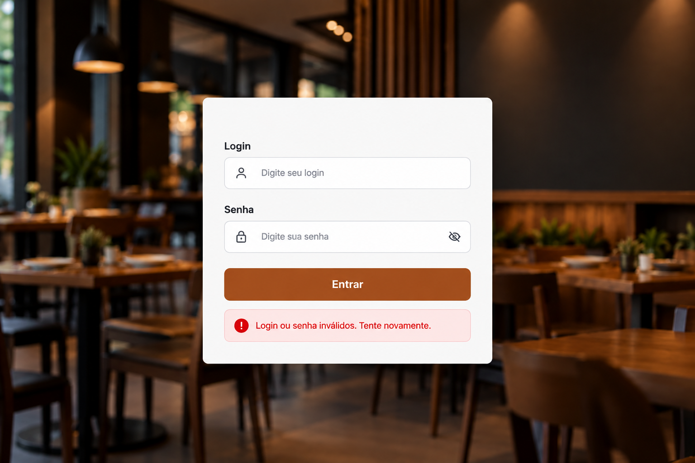
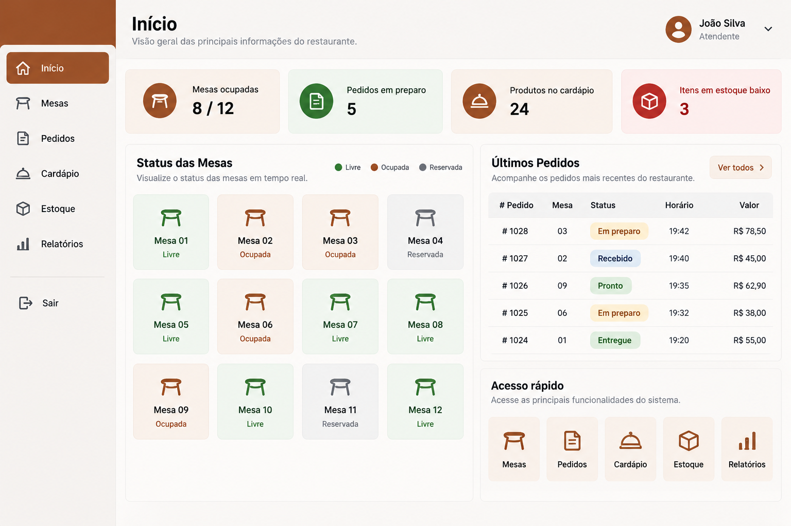
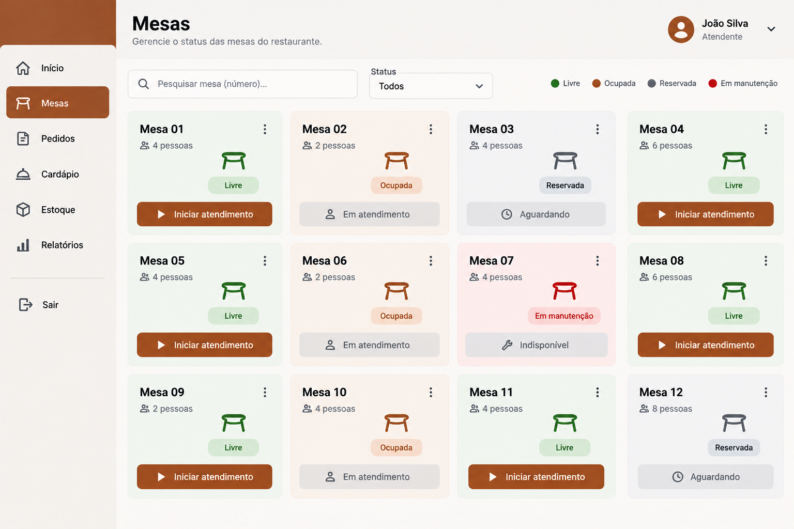
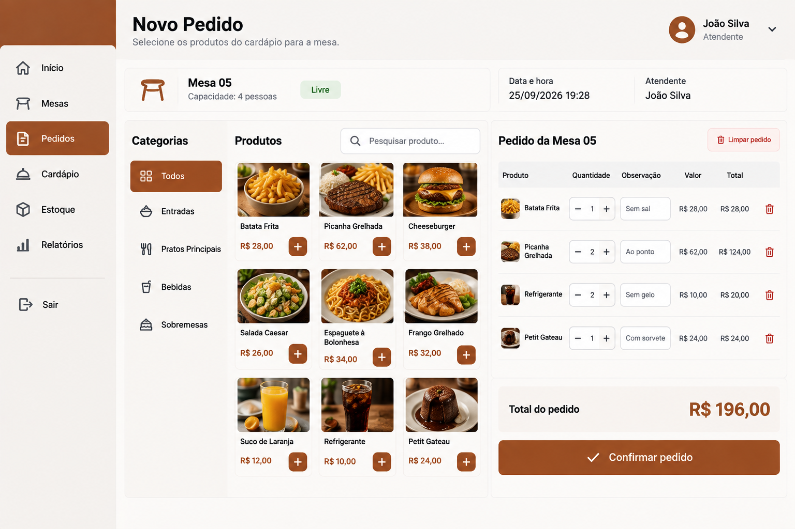
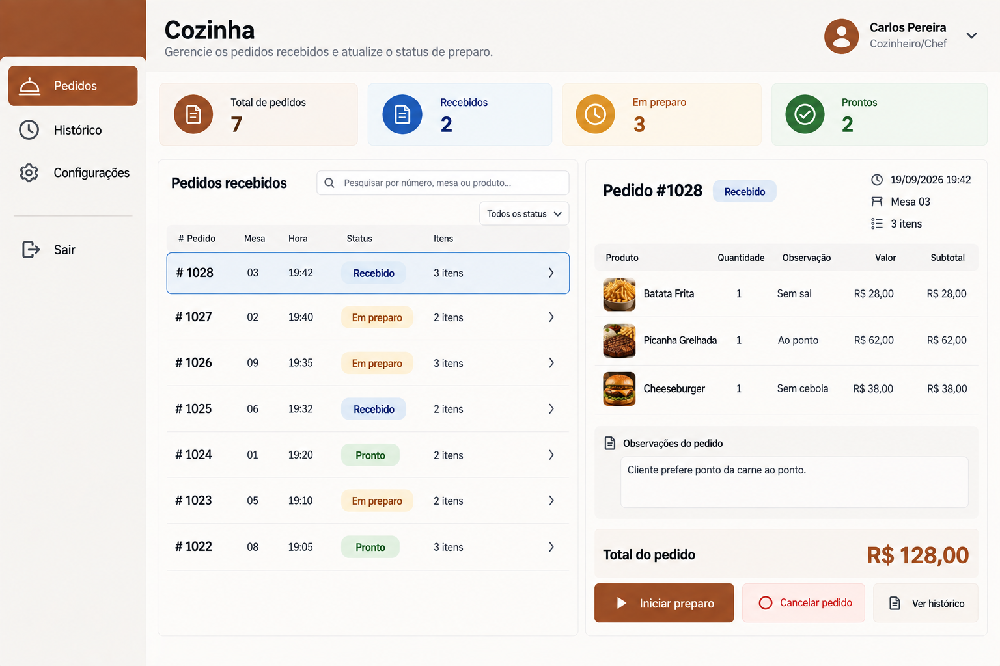
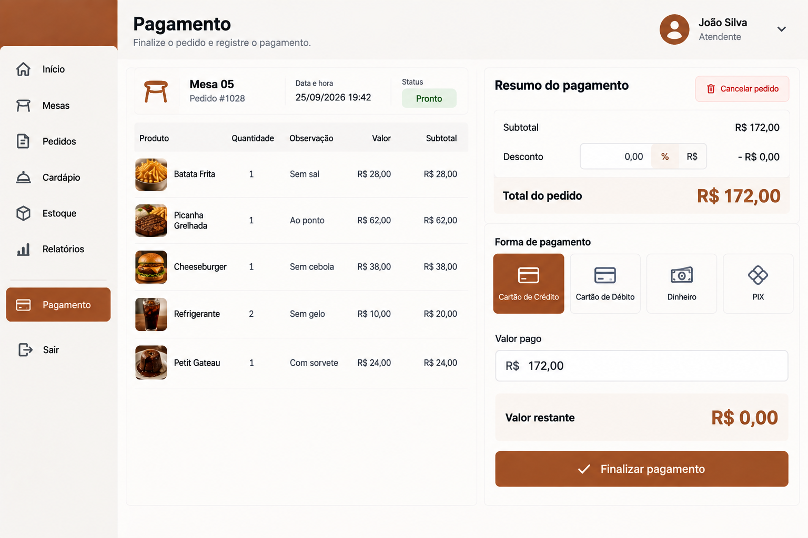
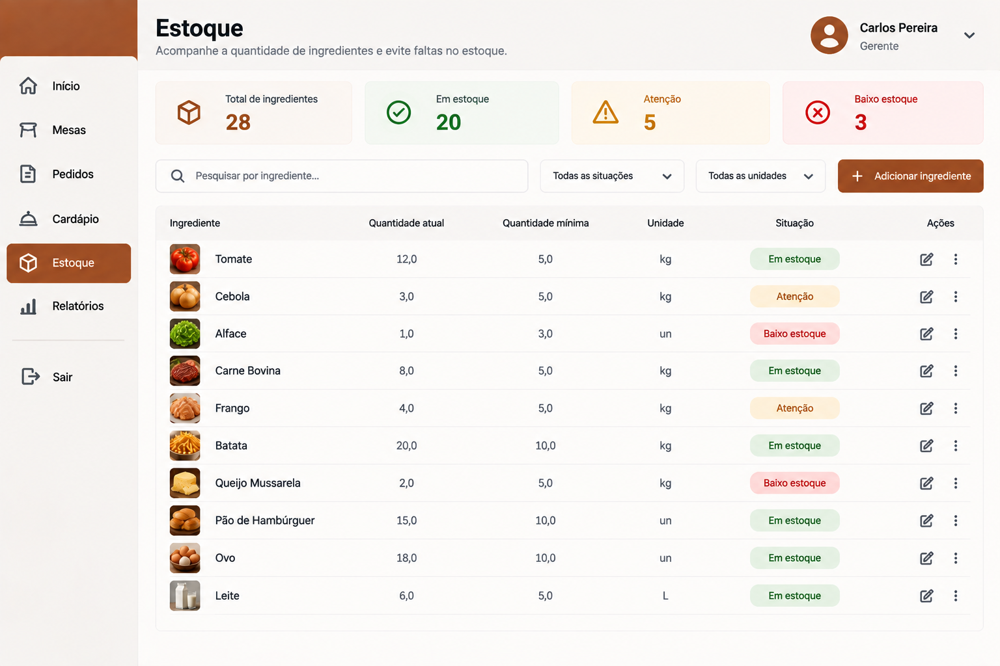

## 7.1 Levantamento das telas

As telas foram definidas a partir dos requisitos funcionais que participam do fluxo principal do sistema.

| Requisito | Funcionalidade | Tela necessária | Perfil que utiliza |
|---|---|---|---|
| RF02 | Autenticar usuário | Login | Usuários internos |
| RF03 | Controlar acesso | Tela inicial | Usuários internos |
| RF05 | Consultar produtos e categorias | Cardápio | Atendente/Cliente |
| RF08 | Registrar pedido vinculado à mesa | Mesas / Novo pedido | Atendente |
| RF09 | Acessar cardápio e realizar pedido | Cardápio da mesa | Cliente |
| RF10 | Acompanhar e atualizar pedidos | Acompanhamento de pedidos | Atendente/Cozinha |
| RF11 | Visualizar e atualizar pedidos | Cozinha | Cozinheiro/Chef |
| RF12 | Verificar disponibilidade | Novo pedido | Sistema/Atendente |
| RF13 | Reservar ingredientes | Novo pedido | Sistema |
| RF14 | Realizar baixa dos ingredientes | Estoque | Sistema/Estoquista |
| RF17 | Fechar venda | Fechamento da conta | Atendente |
| RF18 | Registrar pagamento | Pagamento | Atendente |

Os requisitos selecionados estão relacionados ao fluxo de atendimento, pedido, cozinha, estoque e pagamento definido para a primeira versão do sistema. A primeira entrega também determina que o cliente acessará o sistema por meio da identificação da mesa.

## 7.2 Mapa de navegação

```text
                       ┌──────────────┐
                       │    LOGIN     │
                       └──────┬───────┘
                              │
                              ▼
                    ┌──────────────────┐
                    │   TELA INICIAL   │
                    └────────┬─────────┘
                             │
        ┌────────────────────┼────────────────────┐
        │                    │                    │
        ▼                    ▼                    ▼
 ┌─────────────┐     ┌────────────────┐    ┌─────────────┐
 │    MESAS    │     │ ACOMPANHAMENTO │    │   ESTOQUE   │
 └──────┬──────┘     │  DE PEDIDOS    │    └─────────────┘
        │             └────────────────┘
        ▼
 ┌──────────────┐
 │ NOVO PEDIDO  │
 └──────┬───────┘
        │
        ▼
 ┌──────────────┐
 │   CARDÁPIO   │
 └──────┬───────┘
        │
        ▼
 ┌─────────────────┐
 │ ACOMPANHAMENTO  │
 │   DE PEDIDOS    │
 └────────┬────────┘
          │
          ▼
 ┌──────────────────┐
 │ FECHAMENTO DA    │
 │      CONTA       │
 └────────┬─────────┘
          │
          ▼
    ┌────────────┐
    │ PAGAMENTO  │
    └────────────┘


                  ┌────────────────┐
                  │    COZINHA     │
                  └────────────────┘
```

## 7.3 Esboços e protótipos

As principais telas que deverão ser prototipadas são:

### Tela de Login

- Login;
- Senha;
- Botão Entrar;
- Mensagem de erro para dados inválidos.



[🔎 Abrir protótipo da Tela de Login em tamanho original](./imagens/tela-login.png)

---

### Tela Inicial

- Menu principal;
- Mesas;
- Pedidos;
- Cardápio;
- Estoque;
- Relatórios;
- Identificação do usuário.



[🔎 Abrir protótipo da Tela Inicial em tamanho original](./imagens/tela-inicial.png)

---

### Tela de Mesas

- Número da mesa;
- Capacidade;
- Status da mesa;
- Opção de iniciar atendimento.



[🔎 Abrir protótipo da Tela de Mesas em tamanho original](./imagens/tela-mesas.png)

---

### Tela de Novo Pedido

- Categorias;
- Produtos;
- Quantidade;
- Observação;
- Valor;
- Total do pedido;
- Botão para confirmar.



[🔎 Abrir protótipo da Tela de Novo Pedido em tamanho original](./imagens/tela-novo-pedido.png)

---

### Tela da Cozinha

- Pedidos recebidos;
- Número da mesa;
- Produtos;
- Quantidades;
- Observações;
- Status do pedido;
- Botões para atualizar o status.



[🔎 Abrir protótipo da Tela da Cozinha em tamanho original](./imagens/tela-cozinha.png)

---

### Tela de Acompanhamento

- Número do pedido;
- Mesa;
- Produtos;
- Status: Recebido, Em preparo, Pronto, Entregue ou Cancelado.


[🔎 Abrir protótipo da Tela de Acompanhamento em tamanho original](./imagens/tela-acompanhamento.png)

---

### Tela de Pagamento

- Valor total;
- Desconto, quando permitido;
- Forma de pagamento;
- Valor pago;
- Valor restante;
- Botão para finalizar.



[🔎 Abrir protótipo da Tela de Pagamento em tamanho original](./imagens/tela-pagamento.png)

---

### Tela de Estoque

- Ingrediente;
- Quantidade atual;
- Quantidade mínima;
- Unidade de medida;
- Situação do estoque.



---

## Voltar Para:

[**Sistema de Gestão de Restaurante**](https://github.com/JoaoVitorPresner/Sistema-de-Gestao-de-Restaurante)

[🔎 Abrir protótipo da Tela de Estoque em tamanho original](./imagens/tela-estoque.png)

---

Os protótipos deverão apresentar mensagens de validação e confirmação e manter uma padronização visual entre as telas.
